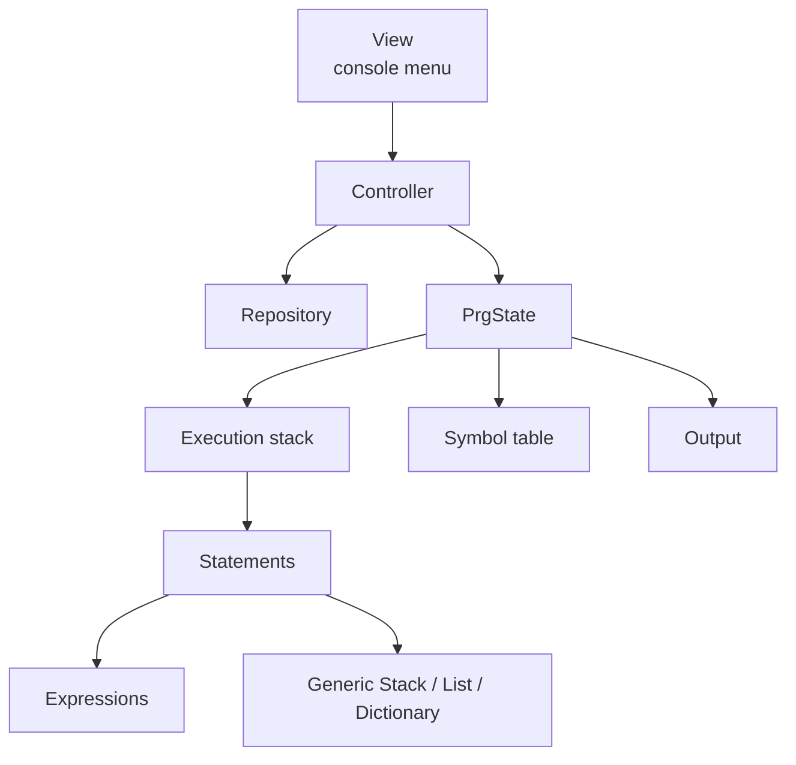

# Custom Language Runtime

Java interpreter for a small imperative language. Programs are built as an AST of statements and expressions, then executed step by step against a program state (execution stack, symbol table, output).

University project focused on runtime design, not on shipping a product.

## What it does

The console UI offers three sample programs, for example:

1. `int v; v = 2; print(v)`
2. arithmetic with operator precedence (`2 + 3 * 5`)
3. `if` with a boolean condition

You can run **one step** or **all steps**. Each step pops a statement from the execution stack and applies it to the current program state.

## Tech stack

- Java
- MVC: `View` → `Controller` → `Repository` / `Model`
- Custom ADTs: generic stack, list, and dictionary
- Statement and expression interfaces (easy to add new language constructs)

## Architecture



**Packages**

| Package | Role |
| --- | --- |
| `View` | Menu and sample programs |
| `Controller` | One-step / all-steps execution |
| `Repository` | Holds the current program state |
| `Model.Statement` | `VarDecl`, `Assign`, `If`, `Print`, `Comp` |
| `Model.Expression` | values, variables, arithmetic |
| `Model.State` | execution stack, symbol table, output |
| `ADT` | generic collections used by the runtime |
| `Exception` | typed interpreter errors |

## Run locally

Open the project in IntelliJ (or any Java IDE) and run `src/Main.java`.

```text
1. int v; v=2;Print(v)
2. int a;int b; a=2+3*5;b=a+1;Print(b)
3. bool a; int v; a=true;(If a Then v=2 Else v=3);Print(v)
0. Exit
```

## Design notes

- **MVC** keeps parsing/UI, execution, and storage separate
- Statements implement `execute(PrgState)`, so new language features are new classes, not a bigger switch
- Compound statements push inner statements onto the execution stack instead of nesting execution in one call
- Arithmetic expressions evaluate against the symbol table and raise typed errors (division by zero, missing symbols, empty stack)

## What a recruiter should look at

- `Controller.executeOneStep()` — the interpreter loop
- `Model/Statement` and `Model/Expression` — how the language is represented
- `ADT/` — collections written from scratch instead of relying on `java.util` for the runtime core
